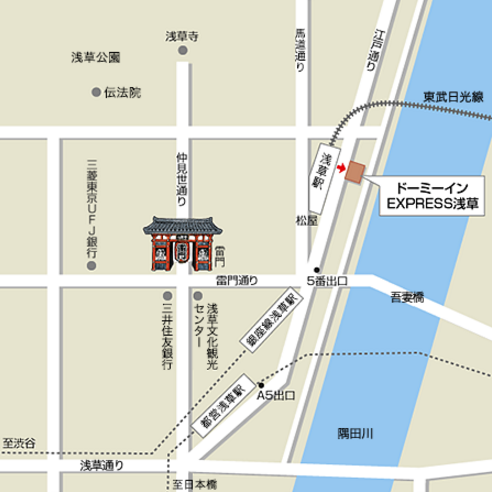
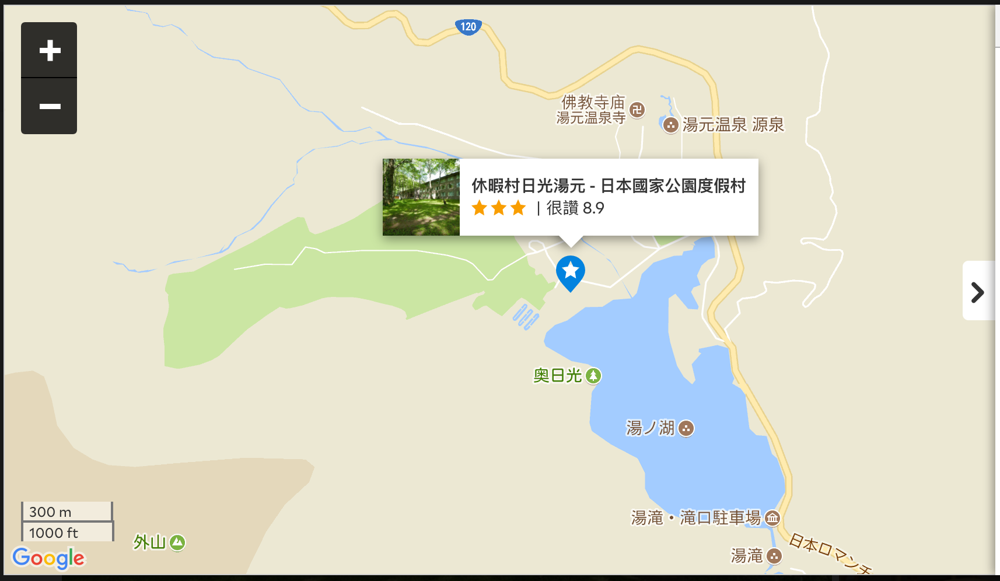

#住宿

### 第一晚

[淺草 Dormy Inn Express](https://cline1413.com.tw/2016-10-26-1348/)

地址：東京都台東區花川戸1-3-4 
電話：(03) 3845-1122

入住時間：15:00

退房時間：11:00

24小時前台服務

價錢：$ 1,400 / 人

### 第二晚

[休暇村日光湯元 - 日本國家公園度假村 (Kyukamura Nikko-Yumoto National Park Resorts of Japan)](https://www.agoda.com/zh-tw/kyukamura-nikko-yumoto-national-park-resorts-of-japan/hotel/tochigi-jp.html?checkin=2017-09-14&los=1&adults=2&rooms=1&cid=1618670&tag=d6c9ef77-9b55-8227-c16c-00378f711dc3&searchrequestid=160a3930-d867-4236-aae4-fe8b274a572f)

地址：Yumoto Onsen, 日光, 栃木, 日本, 321-1662

電話：(03) 3845-1122

入住時間：15:00 - 18:00

退房時間：10:00

前台服務：21:00

價錢：$ 4,500 / 人

