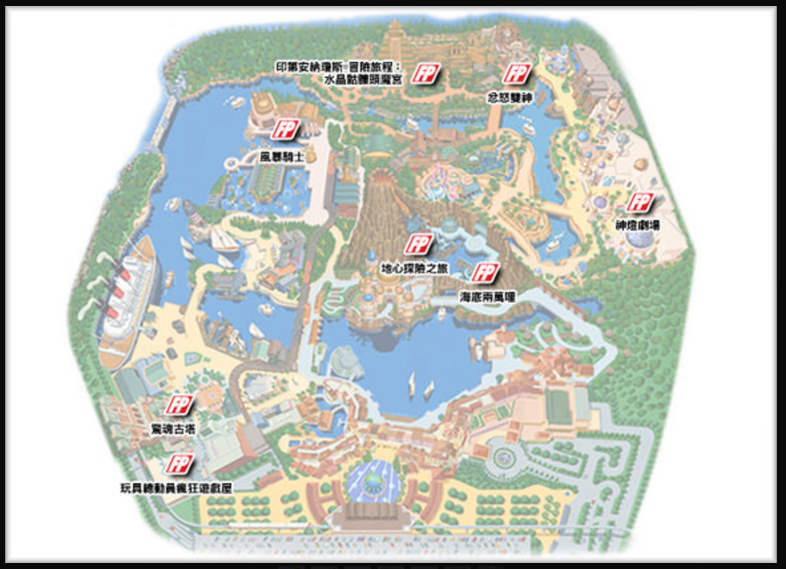
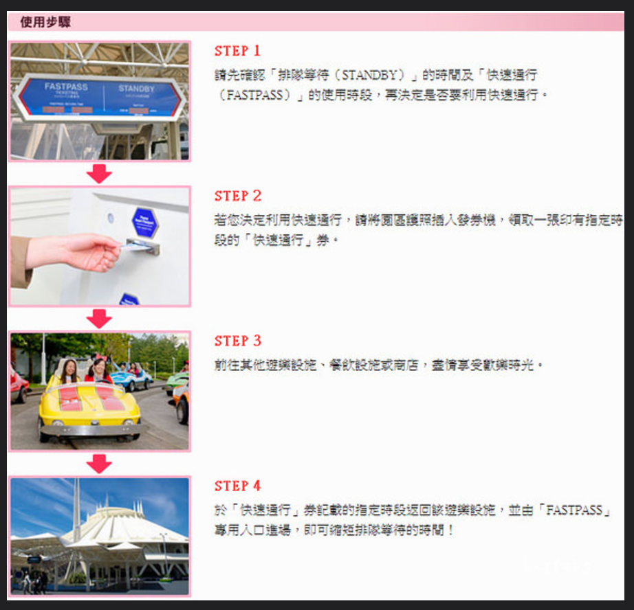
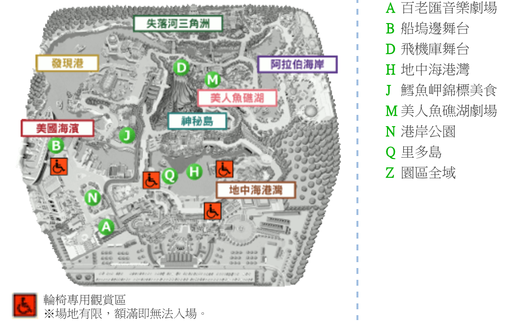

#### 快速通關攻略

FASTPASS (從第一次抽的時間起算，兩個小時才能再抽第二次，所以越早抽越好。)

必玩設施：

1. 玩具總動員瘋狂遊戲屋 (最新大人氣的遊樂設施)
2. 驚魂古塔
3. 忿怒雙神
4. 印第安納瓊斯®冒險旅程：水晶骷髏頭魔宮

#### 活動時間 (官網資料)

| 名稱 | 地點 | 時間 |
|-|-|-|
| [心願寄星空](http://www.tokyodisneyresort.jp/tc/show/detail/str_id:pw_skyhigh_s15/) | Z | 20:30 (約 5 分鐘) |
| [閃亮心願之旅](http://www.tokyodisneyresort.jp/tc/show/detail/str_id:mh_15th_crystal/) | H | 11:45 (約 25 分鐘) |
| [美好心願年：彩車巡遊](http://www.tokyodisneyresort.jp/tc/show/detail/str_id:aw_gd/) |  | 13:15 / 16:00 |
| 完美聖誕 | H | 09:30 / 14:30 |
| 絢彩聖誕 ～夜語心願～ | H | 19:55 |
| [走出闇影森林](http://www.tokyodisneyresort.jp/tc/show/detail/str_id:ld_oos/) | D | 12:00 / 13:30 / 15:00 / 17:15 / 18:45 (約 25 分鐘) |
| [Fantasmic!](http://www.tokyodisneyresort.jp/tc/show/detail/str_id:mh_fantasmic) | H | 17:30 (約 25 分鐘) |
| [動感大樂團](http://www.tokyodisneyresort.jp/tc/show/detail/str_id:aw_band) | A | 12:00 / 13:30 / 15:00 / 17:10 / 18:40 (約 30 分鐘) |
| [開筵宴客](http://www.tokyodisneyresort.jp/tc/show/detail/str_id:aw_table) | B | 11:05 / 12:35 / 15:10 / 16:40 / 18:15 (約 30 分鐘) |
| [川頓王的音樂會](http://www.tokyodisneyresort.jp/tc/show/detail/str_id:ml_triton/) | M | 10:00-19:30 (約 14 分鐘) |
| [摯友達菲](http://www.tokyodisneyresort.jp/tc/show/detail/str_id:aw_duffy) | J | 9:30-17:00 (每段故事 10 分鐘)|

